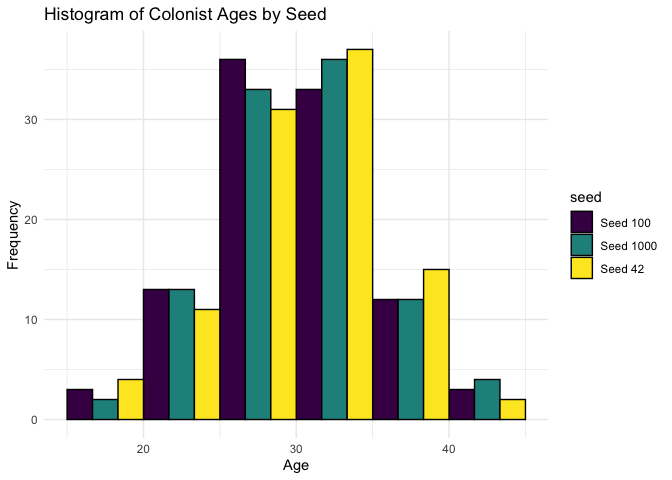
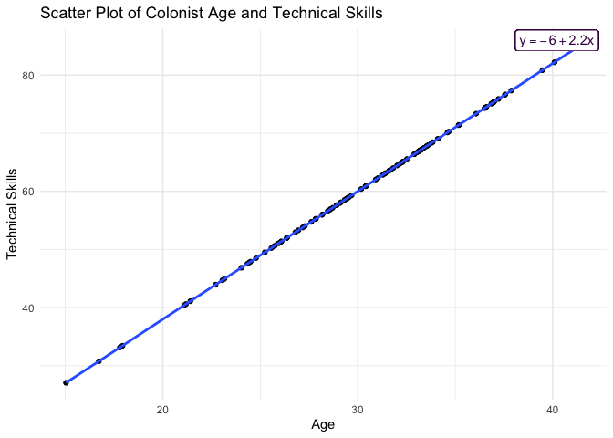
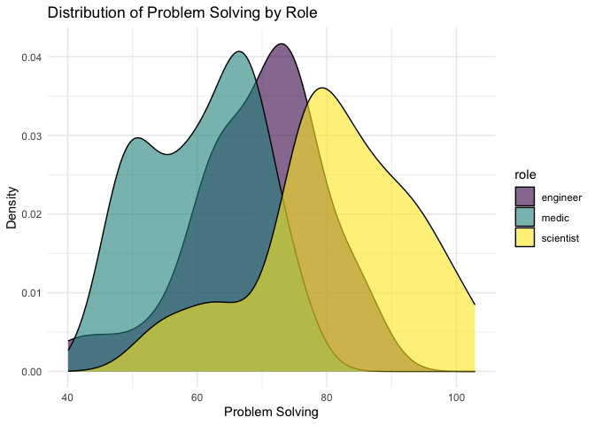
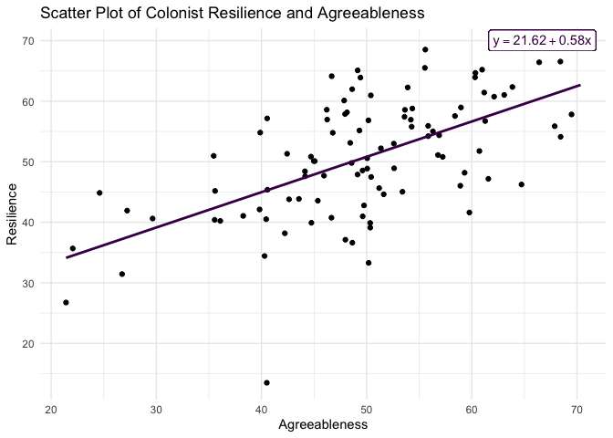
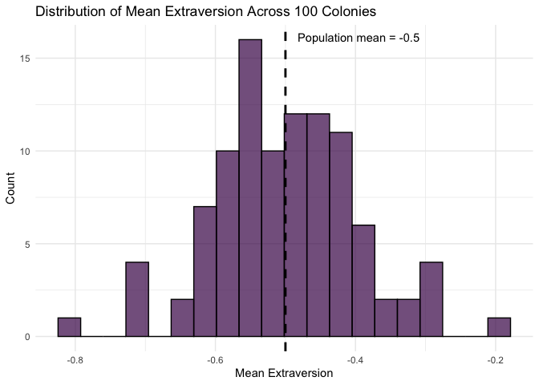
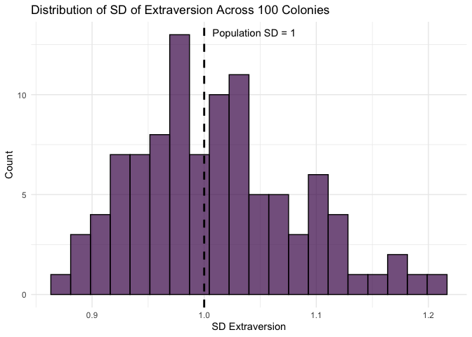
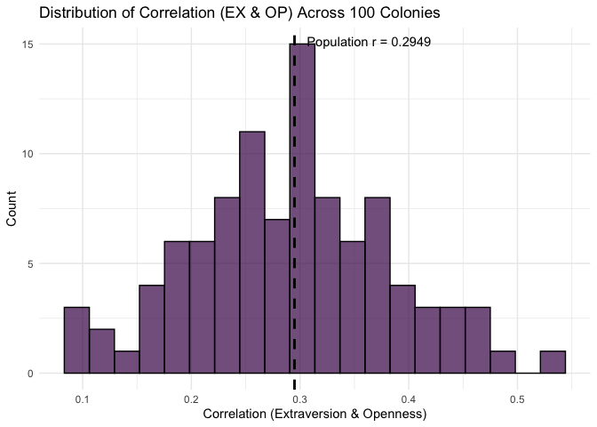
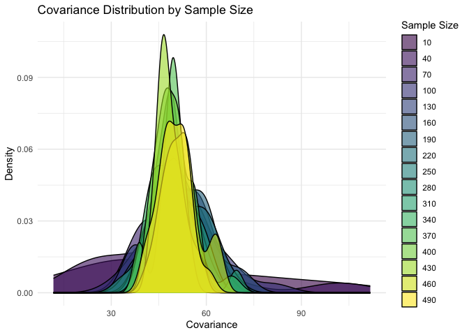
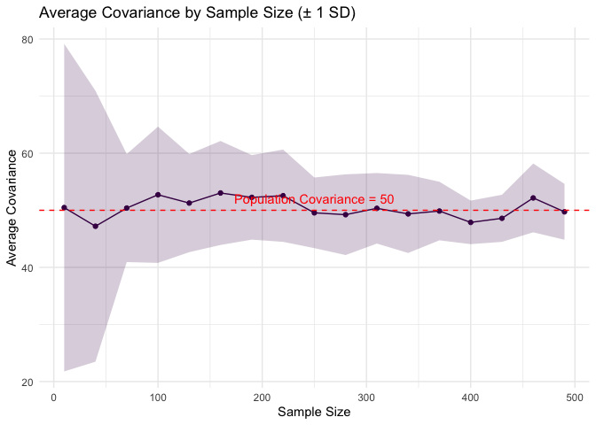

Lab 13 - Colonizing Mars
================
Insert your name here
Insert date here

### Load packages and data

``` r
library(tidyverse) 
library(ggplot2)
library(MASS)
library(tidyverse)
library(viridis)
```

BTW In this lab, there are much random seeds needed, I choose the
ultimate answer to life, the universe, and everything :

<span style="
background: linear-gradient(90deg, red, orange, yellow, green, blue, indigo, violet);
-webkit-background-clip: text;
color: transparent;"> 42 </span>

as the random seed.

ALso Many of my visualizations also draw on your code, and I like
viridis color:)

### Exercise 1

#### 1.1

``` r
set.seed(42)
age <- rnorm(100, mean = 30, sd = 5)
df_colonists <- data.frame(
  id = 1:100,
  age = age
)

head(df_colonists)
```

    ##   id      age
    ## 1  1 36.85479
    ## 2  2 27.17651
    ## 3  3 31.81564
    ## 4  4 33.16431
    ## 5  5 32.02134
    ## 6  6 29.46938

#### 1.2

``` r
set.seed(100)
age2 <- rnorm(100, mean = 30, sd = 5)

set.seed(1000)
age3 <- rnorm(100, mean = 30, sd = 5)

df_hist <- data.frame(
  age = c(age, age2, age3),
  seed = c(
    rep("Seed 42", length(age)),
    rep("Seed 100", length(age2)),
    rep("Seed 1000", length(age3))
  )
)

ggplot(df_hist, aes(x = age, fill = seed)) +
  geom_histogram(
    position = "dodge",
    breaks = seq(from = 5 * floor(min(age) / 5), to = 5 * ceiling(max(age) / 5), by = 5),
    color = "black"
  ) +
  scale_fill_viridis_d() +
  labs(title = "Histogram of Colonist Ages by Seed", x = "Age", y = "Frequency") +
  theme_minimal()
```

<!-- -->

All three distributions are centered around the mean of 30 and have a
roughly normal shape, which is expected because they are all drawn from
the same population distribution (mean = 30, sd = 5).

But each seed produces a different specific sample, the exact shape and
spread of each histogram differs slightly. Besides since we only 100
observations a time, each draw will have more variation.

#### 1.3

``` r
set.seed(42)

df_colonists$role <- rep(c("engineer", "scientist", "medic"), length.out = 100)

table(df_colonists$role)
```

    ## 
    ##  engineer     medic scientist 
    ##        34        33        33

I chose Method A: a repeating cycle of engineer -\> scientist -\> medic
This ensures a nearly perfectly equal distribution across all three
roles. For a Mars colony, having balanced roles is critical — we need
roughly equal numbers of engineers (to maintain infrastructure),
scientists (to conduct research), and medics (to keep everyone healthy).
A repeating pattern ensures no role is underrepresented due to random
chance.

#### 1.4

<!-- -->

### Exercise 2

#### 2.1

``` r
set.seed(42)
df_colonists$technical_skills <- 2 * df_colonists$age + rnorm(100, mean = 0, sd = 1)


model <- lm(technical_skills ~ age, data = df_colonists)
intercept <- coef(model)[1]
slope <- coef(model)[2]

equation <- ifelse(slope >= 0,
  sprintf("y == %.2f + %.2f * x", intercept, slope),
  sprintf("y == %.2f %.2f * x", intercept, slope)
)

ggplot(df_colonists, aes(x = age, y = technical_skills)) +
  geom_point() +
  geom_smooth(method = "lm", se = FALSE, formula = "y ~ x") +
  geom_label(x = Inf, y = Inf, label = equation, hjust = 1.1, vjust = 1.1,
             parse = TRUE, color = viridis_color) +
  labs(title = "Scatter Plot of Colonist Age and Technical Skills",
       x = "Age", y = "Technical Skills") +
  theme_minimal()
```

<!-- -->

#### 2.2

Here I understand the problem-solving skill as the ability of *finding*
and *resolving* a fancy problem.

SO: For Scientists: highest problem-solving (mean = 80 SD= 10), ~~as I’m
a Researcher~~ as they focus on analytical research and that’s how I
understand the problem-solving skill.

For Engineers: moderate problem-solving (mean = 70 SD= 10), ~~as I’m not
an Engineer~~ as they need to diagnose and fix complex technical systems
on Mars.

For medic: not so much problem-solving (mean = 60 SD= 10), No offense as
they their expertise is more specialized in medical knowledge rather
than general problem-solving.

``` r
set.seed(42)
df_colonists$problem_solving[df_colonists$role == "scientist"] = rnorm(sum(df_colonists$role == "scientist"), mean = 80, sd = 10)
df_colonists$problem_solving[df_colonists$role == "engineer"] = rnorm(sum(df_colonists$role == "engineer"), mean = 70, sd = 10)
df_colonists$problem_solving[df_colonists$role == "medic"] = rnorm(sum(df_colonists$role == "medic"), mean = 60, sd = 10)
```

<!-- -->

### Exercise 3

#### 3.1

``` r
set.seed(42)

mean_traits_2var <- c(50, 50)
cov_matrix_2var <- matrix(c(
  100, 50,
  50, 100
), ncol = 2)
traits_data <- mvrnorm(n = 100, mu = mean_traits_2var, Sigma = cov_matrix_2var, empirical = FALSE)
colnames(traits_data) <- c("resilience", "agreeableness")

df_colonists <- cbind(df_colonists, traits_data)
```

<!-- -->

#### 3.2

``` r
set.seed(42)
n_colonists <- 100
var_names <- c("EX", "ES", "AG", "CO", "OP")
mean_traits <- c(-0.5, 0.5, 0.25, 0.5, 0)  
sd_traits <- c(1, 0.9, 1, 1, 1) 

# Correlation matrix from Park et al. (2020)
cor_matrix_bigfive <- matrix(
  c(
    1.0000, 0.2599, 0.1972, 0.1860, 0.2949,
    0.2599, 1.0000, 0.1576, 0.2306, 0.0720,
    0.1972, 0.1576, 1.0000, 0.2866, 0.1951,
    0.1860, 0.2306, 0.2866, 1.0000, 0.1574,
    0.2949, 0.0720, 0.1951, 0.1574, 1.0000
  ),
  nrow = 5, ncol = 5, byrow = TRUE,
  dimnames = list(var_names, var_names)
)

cov_matrix_bigfive <- cor_matrix_bigfive * (sd_traits %*% t(sd_traits))

simulated_data <- mvrnorm(n = n_colonists, mu = mean_traits, Sigma = cov_matrix_bigfive)

simulated_data <- cbind.data.frame(
  colonist_id = 1:n_colonists,
  simulated_data
)
head(simulated_data)
```

    ##   colonist_id         EX         ES          AG         CO         OP
    ## 1           1 -2.1639586 -1.6833888  0.64603024  0.5639917 -1.1412611
    ## 2           2 -0.6173064  1.6364697  1.23724172  0.7995512 -0.3898355
    ## 3           3  0.1777047  0.7771519 -0.82272099 -0.2789770 -0.0765104
    ## 4           4 -0.6324178  1.7217861 -0.06153271  0.6216930 -2.4759784
    ## 5           5 -1.3539503 -0.2545450  0.32431859 -0.1086960  0.8914292
    ## 6           6 -1.3874026  0.4607791  0.86371412  0.4737529  0.7327250

Compare simulated statistics with population parameters:

``` r
# means
summary_stats_mean <- simulated_data %>%
  dplyr::select(-colonist_id,) %>%
  summarize(across(everything(), list(mean = mean))) %>%
  rbind(mean_traits)
#  SDs
summary_stats_sd <- simulated_data %>%
  dplyr::select(-colonist_id,) %>%
  summarize(across(everything(), list(sd = sd))) %>%
  rbind(sd_traits)

summary_stats <- cbind(summary_stats_mean, summary_stats_sd)
rownames(summary_stats) <- c("Simulated", "Population")
summary_stats
```

    ##               EX_mean  ES_mean   AG_mean CO_mean    OP_mean   EX_sd     ES_sd
    ## Simulated  -0.5346433 0.529558 0.2253254 0.39294 0.06203738 1.05018 0.9630686
    ## Population -0.5000000 0.500000 0.2500000 0.50000 0.00000000 1.00000 0.9000000
    ##                AG_sd     CO_sd     OP_sd
    ## Simulated  0.9015048 0.9236847 0.9909539
    ## Population 1.0000000 1.0000000 1.0000000

``` r
# Compare correlation matrices
simulated_data %>%
  dplyr::select(-colonist_id,) %>%
  cor() %>%
  round(4)
```

    ##        EX     ES     AG     CO     OP
    ## EX 1.0000 0.2960 0.1980 0.2960 0.2634
    ## ES 0.2960 1.0000 0.1714 0.4602 0.1637
    ## AG 0.1980 0.1714 1.0000 0.3237 0.2727
    ## CO 0.2960 0.4602 0.3237 1.0000 0.2548
    ## OP 0.2634 0.1637 0.2727 0.2548 1.0000

``` r
round(cor_matrix_bigfive, 4)
```

    ##        EX     ES     AG     CO     OP
    ## EX 1.0000 0.2599 0.1972 0.1860 0.2949
    ## ES 0.2599 1.0000 0.1576 0.2306 0.0720
    ## AG 0.1972 0.1576 1.0000 0.2866 0.1951
    ## CO 0.1860 0.2306 0.2866 1.0000 0.1574
    ## OP 0.2949 0.0720 0.1951 0.1574 1.0000

wrapp the whole procedure into a function:

``` r
simulate_colonists <- function(seed,
                               n_colonists = 100,
                               mean_traits = c(-0.5, 0.5, 0.25, 0.5, 0),
                               sd_traits = c(1, 0.9, 1, 1, 1),
                               var_names = c("EX", "ES", "AG", "CO", "OP")) {
  
  # Load required package
  if (!requireNamespace("MASS", quietly = TRUE)) {
    stop("Package 'MASS' is required but not installed.")
  }
  
  # Set seed
  set.seed(seed)

  cor_matrix_bigfive <- matrix(
    c(
      1.0000, 0.2599, 0.1972, 0.1860, 0.2949,
      0.2599, 1.0000, 0.1576, 0.2306, 0.0720,
      0.1972, 0.1576, 1.0000, 0.2866, 0.1951,
      0.1860, 0.2306, 0.2866, 1.0000, 0.1574,
      0.2949, 0.0720, 0.1951, 0.1574, 1.0000
    ),
    nrow = 5, ncol = 5, byrow = TRUE,
    dimnames = list(var_names, var_names)
  )
  
  cov_matrix_bigfive <- cor_matrix_bigfive * (sd_traits %*% t(sd_traits))
  
  simulated_data <- MASS::mvrnorm(
    n = n_colonists,
    mu = mean_traits,
    Sigma = cov_matrix_bigfive
  )
  
  simulated_data <- cbind.data.frame(
    colonist_id = 1:n_colonists,
    seed = seed,
    simulated_data
  )
  
  summary_stats_mean <- simulated_data %>%
    dplyr::select(-colonist_id, -seed) %>%
    dplyr::summarize(dplyr::across(everything(), list(mean = mean))) %>%
    rbind(mean_traits)
  
  summary_stats_sd <- simulated_data %>%
    dplyr::select(-colonist_id, -seed) %>%
    dplyr::summarize(dplyr::across(everything(), list(sd = sd))) %>%
    rbind(sd_traits)

  summary_stats <- cbind(summary_stats_mean, summary_stats_sd)
  rownames(summary_stats) <- c("Simulated", "Population")
  
  simulated_cor <- simulated_data %>%
    dplyr::select(-colonist_id, -seed) %>%
    cor() %>%
    round(4)
  
  population_cor <- round(cor_matrix_bigfive, 4)
  
  # Return results as a list
  return(list(
    seed = seed,
    data = simulated_data,
    summary_table = summary_stats,
    simulated_correlation = simulated_cor,
    population_correlation = population_cor
  ))
}

res1 <- simulate_colonists(111)
res2 <- simulate_colonists(123)
res3 <- simulate_colonists(456)
res4 <- simulate_colonists(789)
res5 <- simulate_colonists(999)

comparison_table <- dplyr::bind_rows(
  cbind(seed = 111, res1$summary_table[1, ]),
  cbind(seed = 123, res2$summary_table[1, ]),
  cbind(seed = 456, res3$summary_table[1, ]),
  cbind(seed = 789, res4$summary_table[1, ]),
  cbind(seed = 999, res5$summary_table[1, ])
)

population_row <- data.frame(
  seed = "Population",
  EX_mean = mean_traits[1],
  ES_mean = mean_traits[2],
  AG_mean = mean_traits[3],
  CO_mean = mean_traits[4],
  OP_mean = mean_traits[5],
  EX_sd = sd_traits[1],
  ES_sd = sd_traits[2],
  AG_sd = sd_traits[3],
  CO_sd = sd_traits[4],
  OP_sd = sd_traits[5]
)


comparison1_table <- rbind(population_row, comparison_table)
rownames(comparison1_table) <- NULL

comparison1_table
```

    ##         seed    EX_mean   ES_mean    AG_mean   CO_mean     OP_mean     EX_sd
    ## 1 Population -0.5000000 0.5000000 0.25000000 0.5000000  0.00000000 1.0000000
    ## 2        111 -0.5055635 0.6823556 0.20868993 0.4449539  0.01473961 1.1147664
    ## 3        123 -0.4295070 0.4484725 0.08054744 0.4261922 -0.05340893 1.0264519
    ## 4        456 -0.3583748 0.3562325 0.15592193 0.3394519 -0.14627960 0.9727729
    ## 5        789 -0.4282128 0.4222546 0.35702404 0.4364122  0.04517403 0.9150672
    ## 6        999 -0.4543131 0.4684608 0.35503349 0.5301957  0.15023510 1.0283704
    ##       ES_sd     AG_sd     CO_sd     OP_sd
    ## 1 0.9000000 1.0000000 1.0000000 1.0000000
    ## 2 0.8595064 0.9457648 1.1100986 0.9354673
    ## 3 0.8757419 0.9680021 0.9656233 0.8527133
    ## 4 0.8465029 1.0224335 0.9536041 0.9753817
    ## 5 0.8679156 1.0282871 1.0740776 1.0059415
    ## 6 0.9175655 1.0232064 0.9753499 0.7638665

``` r
cor_results <- list(
  Population = res1$population_correlation,
  Seed_111 = res1$simulated_correlation,
  Seed_123 = res2$simulated_correlation,
  Seed_456 = res3$simulated_correlation,
  Seed_789 = res4$simulated_correlation,
  Seed_999 = res5$simulated_correlation
)

cor_results
```

    ## $Population
    ##        EX     ES     AG     CO     OP
    ## EX 1.0000 0.2599 0.1972 0.1860 0.2949
    ## ES 0.2599 1.0000 0.1576 0.2306 0.0720
    ## AG 0.1972 0.1576 1.0000 0.2866 0.1951
    ## CO 0.1860 0.2306 0.2866 1.0000 0.1574
    ## OP 0.2949 0.0720 0.1951 0.1574 1.0000
    ## 
    ## $Seed_111
    ##        EX     ES     AG     CO     OP
    ## EX 1.0000 0.1570 0.2590 0.2912 0.3397
    ## ES 0.1570 1.0000 0.2129 0.3224 0.0344
    ## AG 0.2590 0.2129 1.0000 0.3605 0.2183
    ## CO 0.2912 0.3224 0.3605 1.0000 0.1809
    ## OP 0.3397 0.0344 0.2183 0.1809 1.0000
    ## 
    ## $Seed_123
    ##        EX      ES     AG     CO      OP
    ## EX 1.0000  0.1823 0.2002 0.2290  0.2735
    ## ES 0.1823  1.0000 0.1403 0.2327 -0.0894
    ## AG 0.2002  0.1403 1.0000 0.1867  0.0303
    ## CO 0.2290  0.2327 0.1867 1.0000  0.1125
    ## OP 0.2735 -0.0894 0.0303 0.1125  1.0000
    ## 
    ## $Seed_456
    ##        EX     ES     AG     CO     OP
    ## EX 1.0000 0.1299 0.2051 0.2686 0.3400
    ## ES 0.1299 1.0000 0.1688 0.2125 0.0008
    ## AG 0.2051 0.1688 1.0000 0.3764 0.2573
    ## CO 0.2686 0.2125 0.3764 1.0000 0.1960
    ## OP 0.3400 0.0008 0.2573 0.1960 1.0000
    ## 
    ## $Seed_789
    ##        EX     ES     AG     CO     OP
    ## EX 1.0000 0.2418 0.1531 0.1236 0.3113
    ## ES 0.2418 1.0000 0.1063 0.1969 0.1116
    ## AG 0.1531 0.1063 1.0000 0.2865 0.1661
    ## CO 0.1236 0.1969 0.2865 1.0000 0.1408
    ## OP 0.3113 0.1116 0.1661 0.1408 1.0000
    ## 
    ## $Seed_999
    ##        EX      ES     AG     CO      OP
    ## EX 1.0000  0.3392 0.2720 0.2845  0.0345
    ## ES 0.3392  1.0000 0.1683 0.2024 -0.1374
    ## AG 0.2720  0.1683 1.0000 0.3382  0.0769
    ## CO 0.2845  0.2024 0.3382 1.0000  0.0438
    ## OP 0.0345 -0.1374 0.0769 0.0438  1.0000

Overal, the simulated means and SDs are close to the population
parameters, but not identical. Similarly, the simulated correlation
matrix aare close to the population correlation matrix from Park, but
not identical. this is expected with a sample of only 100.

### Exercise 4

#### 4.1

    ## # A tibble: 6 × 6
    ##     rep EX_mean EX_sd   OP_mean OP_sd cor_EX_OP
    ##   <int>   <dbl> <dbl>     <dbl> <dbl>     <dbl>
    ## 1     1  -0.535 1.05   0.0620   0.991     0.263
    ## 2     2  -0.490 1.08   0.0740   0.941     0.198
    ## 3     3  -0.447 0.992  0.0760   0.985     0.246
    ## 4     4  -0.701 1.04  -0.121    1.06      0.399
    ## 5     5  -0.414 0.994 -0.000187 1.02      0.372
    ## 6     6  -0.699 1.10  -0.0137   0.975     0.348

#### 4.2

``` r
ggplot(summary_stats_by_rep, aes(x = EX_mean)) +
  geom_histogram(fill = viridis(1, option = "D"), color = "black", bins = 20, alpha = 0.7) +
  geom_vline(xintercept = mean_traits[1], color = "black", linetype = "dashed", linewidth = 1) +
  annotate("text", x = mean_traits[1], y = Inf, vjust = 2, hjust = -0.1,
           label = paste("Population mean =", mean_traits[1]), color = "black") +
  labs(title = "Distribution of Mean Extraversion Across 100 Colonies",
       x = "Mean Extraversion", y = "Count") +
  theme_minimal()
```

<!-- -->

``` r
ggplot(summary_stats_by_rep, aes(x = EX_sd)) +
  geom_histogram(fill = viridis(1, option = "D"), color = "black", bins = 20, alpha = 0.7) +
  geom_vline(xintercept = sd_traits[1], color = "black", linetype = "dashed", linewidth = 1) +
  annotate("text", x = sd_traits[1], y = Inf, vjust = 2, hjust = -0.1,
           label = paste("Population SD =", sd_traits[1]), color = "black") +
  labs(title = "Distribution of SD of Extraversion Across 100 Colonies",
       x = "SD Extraversion", y = "Count") +
  theme_minimal()
```

<!-- -->

``` r
# Distribution of correlation between Extraversion and Openness
pop_cor_EX_OP <- cor_matrix_bigfive["EX", "OP"]

ggplot(summary_stats_by_rep, aes(x = cor_EX_OP)) +
  geom_histogram(fill = viridis(1, option = "D"), color = "black", bins = 20, alpha = 0.7) +
  geom_vline(xintercept = pop_cor_EX_OP, color = "black", linetype = "dashed", linewidth = 1) +
  annotate("text", x = pop_cor_EX_OP, y = Inf, vjust = 2, hjust = -0.1,
           label = paste("Population r =", round(pop_cor_EX_OP, 4)), color = "black") +
  labs(title = "Distribution of Correlation (EX & OP) Across 100 Colonies",
       x = "Correlation (Extraversion & Openness)", y = "Count") +
  theme_minimal()
```

<!-- -->

although the population correlation is fixed, the correlation between
extraversion and openness varies across colonies, Most simulated
correlations cluster around the population parameter, but individual
colonies produce slightly different estimates due to sampling
variability. Each colony represents a random sample, and if the sample
size were smaller, the distribution of correlations would be wider,
indicating less stable estimates. (that’s the conception of standard
error???) Increasing the sample size reduces sampling error and leads to
more consistent estimates.

As for the ideal sample size, I think there might be some diminishing
returns involved, so perhaps there’s an optimal range, but I suspect
there may be other factors need to be considered.

### Stretch Task

#### 5.1.\*\* Simulate colonies at varying sample sizes and plot the average covariance:

``` r
set.seed(124)
sample_sizes <- seq(10, 500, by = 30)
repetitions_per_condition <- 20
mean_skills <- c(50, 50)
cov_skills <- matrix(c(100, 50, 50, 100), ncol = 2)

# Initialize results dataframe
simulation_results_cov <- data.frame(
  SampleSize = integer(),
  Repetition = integer(),
  Covariance = numeric()
)

# Nested loop for simulations
for (size in sample_sizes) {
  for (rep in 1:repetitions_per_condition) {
    skills_data <- mvrnorm(n = size, mu = mean_skills, Sigma = cov_skills, empirical = FALSE)
    current_covariance <- cov(skills_data[, 1], skills_data[, 2])
    
    simulation_results_cov <- rbind(simulation_results_cov, data.frame(
      SampleSize = size,
      Repetition = rep,
      Covariance = current_covariance
    ))
  }
}

# Plot density of covariance by sample size
simulation_results_cov$SampleSize_factor <- as.factor(simulation_results_cov$SampleSize)

ggplot(simulation_results_cov, aes(x = Covariance, fill = SampleSize_factor)) +
  geom_density(alpha = 0.6) +
  labs(title = "Covariance Distribution by Sample Size",
       x = "Covariance", y = "Density", fill = "Sample Size") +
  scale_fill_viridis_d() +
  theme_minimal()
```

<!-- -->

``` r
# Average covariance by sample size
average_covariances <- simulation_results_cov %>%
  group_by(SampleSize) %>%
  summarize(
    AverageCovariance = mean(Covariance),
    SD_Covariance = sd(Covariance)
  )

ggplot(average_covariances, aes(x = SampleSize, y = AverageCovariance)) +
  geom_point(color = viridis(1)) +
  geom_line(color = viridis(1)) +
  geom_ribbon(aes(ymin = AverageCovariance - SD_Covariance,
                  ymax = AverageCovariance + SD_Covariance),
              alpha = 0.2, fill = viridis(1)) +
  geom_hline(yintercept = 50, color = "red", linetype = "dashed") +
  annotate("text", x = 250, y = 52, label = "Population Covariance = 50", color = "red") +
  labs(title = "Average Covariance by Sample Size (± 1 SD)",
       x = "Sample Size", y = "Average Covariance") +
  theme_minimal()
```

<!-- -->

> As sample size increases, the distribution of estimated covariances
> becomes tighter (lower variability) and more closely centered on the
> true population covariance of 50. This demonstrates the law of large
> numbers — larger samples produce more stable and accurate estimates.
> For colony planning, this means that a larger colony would give us
> more reliable estimates of the relationships between colonist traits,
> which is crucial for resource allocation and team composition
> decisions.
